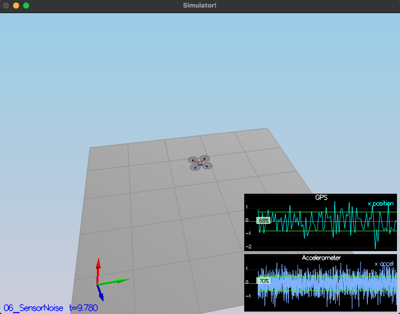
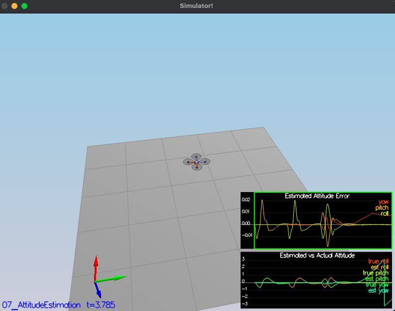
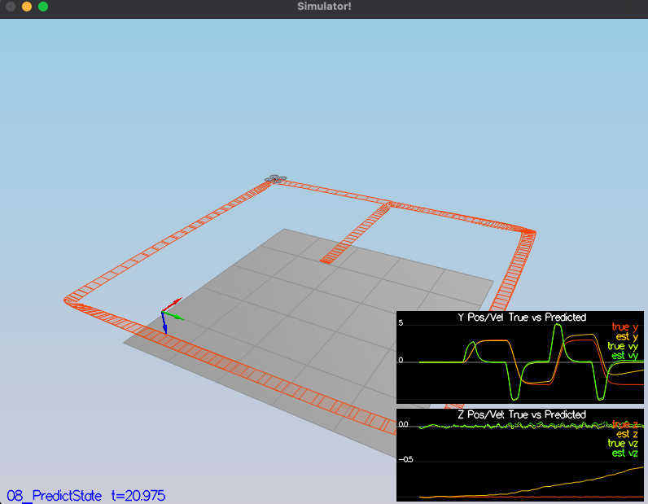
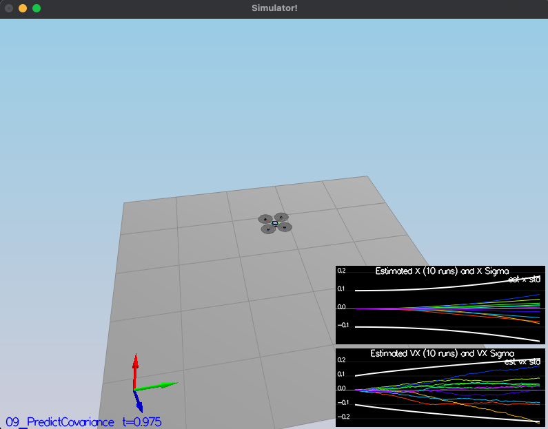
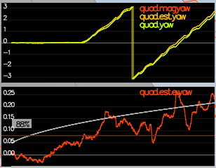

# Estimation Project #

This README is broken down into the following sections:

 - [Setup](#setup) - the environment and code setup required to get started and a brief overview of the project structure
 - [The Scenarios](#the-scenarios) - the scenarios that test the performance of the controller and estimators


## Setup ##

 1. Clone the repository
 ```
 git clone https://github.com/l0g1c-80m8/3d-drone-estimation.git
 ```

 2. Import the code into your IDE like done in the [Controls C++ project](https://github.com/l0g1c-80m8/3d-drone-controller#development-environment-setup)
 
 3. You should now be able to compile and run the estimation simulator just as you did in the controls project


### Project Structure ###

For this project, you will be interacting with a few more files than before.

 - The EKF is already partially implemented for you in `QuadEstimatorEKF.cpp`

 - Parameters for tuning the EKF are in the parameter file `QuadEstimatorEKF.txt`

 - When you turn on various sensors (the scenarios configure them, e.g. `Quad.Sensors += SimIMU, SimMag, SimGPS`), additional sensor plots will become available to see what the simulated sensors measure.

 - The EKF implementation exposes both the estimated state and a number of additional variables. In particular:

   - `Quad.Est.E.X` is the error in estimated X position from true value.  More generally, the variables in `<vehicle>.Est.E.*` are relative errors, though some are combined errors (e.g. MaxEuler).

   - `Quad.Est.S.X` is the estimated standard deviation of the X state (that is, the square root of the appropriate diagonal variable in the covariance matrix). More generally, the variables in `<vehicle>.Est.S.*` are standard deviations calculated from the estimator state covariance matrix.

   - `Quad.Est.D` contains miscellaneous additional debug variables useful in diagnosing the filter. You may or might not find these useful but they were helpful to us in verifying the filter and may give you some ideas if you hit a block.


#### `config` Directory ####

In the `config` directory, in addition to finding the configuration files for your controller and your estimator, you will also see configuration files for each of the simulations. In this project, we address scenarios 06 through 11 in the simulation.

As an example, if we look through the configuration file for scenario 07, we see the following parameters controlling the sensor:

```
# Sensors
Quad.Sensors = SimIMU
# use a perfect IMU
SimIMU.AccelStd = 0,0,0
SimIMU.GyroStd = 0,0,0
```

This configuration tells us that the simulator is only using an IMU and the sensor data will have no noise.  You will notice that for each simulator these parameters will change slightly as additional sensors are being used and the noise behavior of the sensors change.


## The Scenarios ##

Outline:

 - [Scenario 6: Sensor Noise](#scenario-6-sensor-noise)
 - [Scenario 7: Attitude Estimation](#scenario-7-attitude-estimation)
 - [Scenarios 8 and 9: Prediction Step](#scenarios-8-and-9-prediction-step)
 - [Scenario 10: Magnetometer Update](#scenario-10-magnetometer-update)
 - [Scenario 11: Closed Loop + GPS Update](#scenario-11-closed-loop--gps-update)
 - [Scenario 12: Adding Your Controller](#scenario-12-adding-your-controller)


### Scenario 6: Sensor Noise ###

The logs generated by running scenario 6 are analyzed to calculate the [standard deviation of the GPS and IMU](analysis/scenario6-sensor-noise-analysis.ipynb) sensor measurements. These values are then used to update the [sensor noise parameters](config/06_SensorNoise.txt):
```
MeasuredStdDev_GPSPosXY = 0.714
MeasuredStdDev_AccelXY = .512
```



The measurements observed consequently are within acceptable range:
```
PASS: ABS(Quad.GPS.X-Quad.Pos.X) was less than MeasuredStdDev_GPSPosXY for 68% of the time
PASS: ABS(Quad.IMU.AX-0.000000) was less than MeasuredStdDev_AccelXY for 70% of the time
```


### Scenario 7: Attitude Estimation ###

In this scenario, the [```UpdateFromIMU()```](src/QuadEstimatorEKF.cpp#L103) function is refactored to implement a better integration scheme that uses current attitude estimates:

- First, the attitude estimates are converted to quaternion form from the Euler angles.
- Then, the measurements in ```gyro``` are integrated for time ```dtIMU``` using the ```IntegrateBodyRate()``` function.
- Finally, the Euler angles are recovered back from the quaternion form.



The test passes successfully after implementing the new integration scheme:
```
PASS: ABS(Quad.Est.E.MaxEuler) was less than 0.100000 for at least 3.000000 seconds
```


### Scenarios 8 and 9: Prediction Step ###

Here the prediction step of the filter is checked.

There are four steps to take here:
1. [```PredictState()```](src/QuadEstimatorEKF.cpp#L174): Here the state prediction step is implemented. Here the accelerations, current state and vehicle attitude angles are used to predict the forward state of the vehicle. After completing this step, it is observed that the estimator state tracks the actual state, with only reasonably slow drift:

2. [```GetRbgPrime()```](src/QuadEstimatorEKF.cpp#L209): Here the partial derivative of the Rbg rotation matrix with respect to yaw is calculated, called the ```RbgPrime``` matrix to be used later in the next step. This function implements the matrix calculation as shown in [equation 52](https://www.overleaf.com/project/5c34caab7ecefc04087273b9).
3. [```Predict()```](src/QuadEstimatorEKF.cpp#L264): Here the calculation of current covariance forwarded by time dt is done using the accelerations and body rates as input according to [equation 51](https://www.overleaf.com/project/5c34caab7ecefc04087273b9) using the ```RbgPrime``` matrix calculated in step 2 above.
4. Finally, the parameters [```QPosXYStd``` and ```QVelXYStd```](config/QuadEstimatorEKF.txt) are tuned to get the covariance (white line) grow like the data. It should look as below:


***Success criteria:*** *This step doesn't have any specific measurable criteria being checked.*


### Scenario 10: Magnetometer Update ###

Up until now we've only used the accelerometer and gyro for our state estimation.  In this step, you will be adding the information from the magnetometer to improve your filter's performance in estimating the vehicle's heading.

1. Run scenario `10_MagUpdate`.  This scenario uses a realistic IMU, but the magnetometer update hasn’t been implemented yet. As a result, you will notice that the estimate yaw is drifting away from the real value (and the estimated standard deviation is also increasing).  Note that in this case the plot is showing you the estimated yaw error (`quad.est.e.yaw`), which is drifting away from zero as the simulation runs.  You should also see the estimated standard deviation of that state (white boundary) is also increasing.

2. Tune the parameter `QYawStd` (`QuadEstimatorEKF.txt`) for the QuadEstimatorEKF so that it approximately captures the magnitude of the drift, as demonstrated here:



3. Implement magnetometer update in the function `UpdateFromMag()`.  Once completed, you should see a resulting plot similar to this one:


***Success criteria:*** *Your goal is to both have an estimated standard deviation that accurately captures the error and maintain an error of less than 0.1rad in heading for at least 10 seconds of the simulation.*

**Hint: after implementing the magnetometer update, you may have to once again tune the parameter `QYawStd` to better balance between the long term drift and short-time noise from the magnetometer.**

**Hint: see section 7.3.2 of [Estimation for Quadrotors](https://www.overleaf.com/read/vymfngphcccj) for a refresher on the magnetometer update.**


### Scenario 11: Closed Loop + GPS Update ###

1. Run scenario `11_GPSUpdate`.  At the moment this scenario is using both an ideal estimator and and ideal IMU.  Even with these ideal elements, watch the position and velocity errors (bottom right). As you see they are drifting away, since GPS update is not yet implemented.

2. Let's change to using your estimator by setting `Quad.UseIdealEstimator` to 0 in `config/11_GPSUpdate.txt`.  Rerun the scenario to get an idea of how well your estimator work with an ideal IMU.

3. Now repeat with realistic IMU by commenting out these lines in `config/11_GPSUpdate.txt`:
```
#SimIMU.AccelStd = 0,0,0
#SimIMU.GyroStd = 0,0,0
```

4. Tune the process noise model in `QuadEstimatorEKF.txt` to try to approximately capture the error you see with the estimated uncertainty (standard deviation) of the filter.

5. Implement the EKF GPS Update in the function `UpdateFromGPS()`.

6. Now once again re-run the simulation.  Your objective is to complete the entire simulation cycle with estimated position error of < 1m (you’ll see a green box over the bottom graph if you succeed).  You may want to try experimenting with the GPS update parameters to try and get better performance.

***Success criteria:*** *Your objective is to complete the entire simulation cycle with estimated position error of < 1m.*

**Hint: see section 7.3.1 of [Estimation for Quadrotors](https://www.overleaf.com/read/vymfngphcccj) for a refresher on the GPS update.**

At this point, congratulations on having a working estimator!

### Scenario 12: Adding Your Controller ###

Up to this point, we have been working with a controller that has been relaxed to work with an estimated state instead of a real state.  So now, you will see how well your controller performs and de-tune your controller accordingly.

1. Replace `QuadController.cpp` with the controller you wrote in the last project.

2. Replace `QuadControlParams.txt` with the control parameters you came up with in the last project.

3. Run scenario `11_GPSUpdate`. If your controller crashes immediately do not panic. Flying from an estimated state (even with ideal sensors) is very different from flying with ideal pose. You may need to de-tune your controller. Decrease the position and velocity gains (we’ve seen about 30% detuning being effective) to stabilize it.  Your goal is to once again complete the entire simulation cycle with an estimated position error of < 1m.

**Hint: you may find it easiest to do your de-tuning as a 2 step process by reverting to ideal sensors and de-tuning under those conditions first.**

***Success criteria:*** *Your objective is to complete the entire simulation cycle with estimated position error of < 1m.*

## Authors ##

Thanks to [Fotokite](https://fotokite.com/) for the initial development of the project code and simulator.